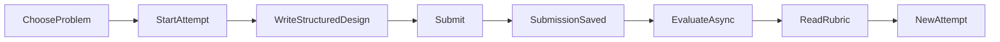

# Design note — Studio LLD

## MVP

A learner can pick a problem, start an attempt, submit structured text, see evaluation status, read an 8-criterion rubric, and inspect past attempts in this browser.

## Domain

| Type | Responsibility | Depends on |
|---|---|---|
| `Problem` | Prompt, requirements, constraints | nothing |
| `Attempt` | One practice session; `IN_PROGRESS → SUBMITTED` | `Problem`, learner id |
| `Submission` | The artifact (`STRUCTURED_TEXT` today) | `Attempt` |
| `Evaluation` | State machine `PENDING → VALIDATING → EVALUATING → COMPLETED \| FAILED` | `Submission`, rubric version |
| `Feedback` | Criterion scores + evidence + suggestions | rubric v1 |
| `StructuralValidator` | Deterministic section checks | format rules |
| `Evaluator` | Judgment (`RubricAIEvaluator` now) | LLM port |

API routes never talk to OpenAI or Prisma directly. `SubmitSolutionService` validates, persists submission, marks the attempt submitted, then creates a `PENDING` evaluation. `RunEvaluationService` is the only path that advances evaluation state. Duplicate submit returns the existing evaluation id (idempotent). Failed evaluations can be retried without a new submission.

### Change test A — new submission format later

`Submission.format` plus `SubmissionValidator` isolate parsing. A class-diagram format would add `DiagramSubmissionValidator` and a UI pane. `Attempt.submit` and evaluation states stay. `Evaluator` still receives a `Submission` + `Problem`.

### Change test B — another evaluator later

`Evaluator` is the seam. A rule-based checker or human review implements the same `evaluate()` contract. The pipeline already treats evaluator exceptions as `FAILED`. No change to the practice HTTP flow.

## Evaluation split

**Deterministic:** required headings, minimum body length, optional mermaid fence shape. Invalid work never reaches the LLM (400).

**Judgment:** eight rubric criteria, JSON-only, temperature 0.2, zod parse. Malformed JSON → `FAILED`, submission kept.

Scores are 1–5 per criterion; overall is the mean. We do not emit a 100-point score.

## Trade-offs

- **Structured text over code:** we get responsibilities and trade-offs without a language runtime. We lose compile/test signals.
- **Cookie identity:** history works for a demo; not multi-device.
- **In-process async:** no Redis. If the process dies, status can sit on `EVALUATING`; retry covers `FAILED`. First scale-out: EvaluationWorker + queue.
- **Heuristic LLM stub:** keeps the demo alive without a key; documented as non-authoritative.

## Scale (light)

If AI is slow, keep the submit request to persist-only (already true). Pull evaluation into a worker next. SQLite is enough for a candidate demo; Postgres is a datasource swap, not a domain rewrite.
